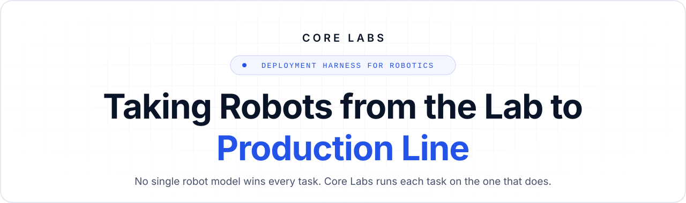
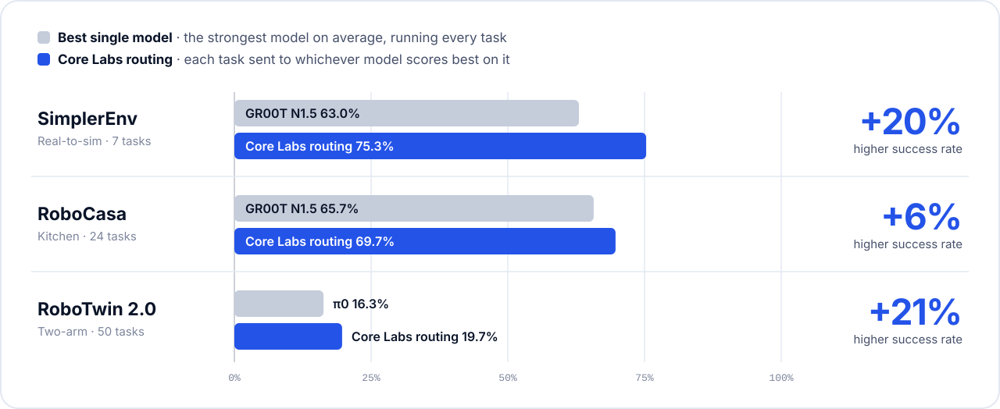

<p align="center">
  
</p>

<p align="center">
  <a href="https://corelabsdemo.vercel.app"></a>
  <a href="mailto:hitarth2004@gmail.com,anandtejas455@gmail.com,vanshwahi786@gmail.com"></a>
</p>

<p align="center">
  
  
  
  
</p>

<br>

On standard benchmarks, routing beats the best single model **every time**:



## Team

<table align="center">
  <tr>
    <td align="center" width="300">
      <br>
      <b>Tejas Anand</b><br>
      <sub>Applied research at NVIDIA<br>Patents in vision &amp; VLMs</sub>
    </td>
    <td align="center" width="300">
      <br>
      <b>Hitarth Khurana</b><br>
      <sub>Robotics at Boxbot<br>and Amazon</sub>
    </td>
    <td align="center" width="300">
      <br>
      <b>Vansh Wahi</b><br>
      <sub>Applied research at Google Gemini<br>Founding engineer, TensorStax (acq. Snowflake)</sub>
    </td>
  </tr>
</table>


<br>

<details>
<summary><b>Run it locally</b></summary>

```bash
npm install
npm run dev
```

The site lives in `src/` (React, Motion, Tailwind, Vite) with media in `clips/`. Every push to `main` deploys to Vercel. The launch film is a [Remotion](https://www.remotion.dev) project in `video/`.

</details>

<details>
<summary><b>Methodology &amp; sources</b></summary>

Routed scores send each task to the model with the highest published success on it, so they are an upper bound on what a router picking from the same pool could reach. `scripts/benchmarks.py` reproduces every number and runs a held-out check on RoboCasa; `scripts/roboarena_routing.py` analyzes the real-robot sessions.

[RoboArena](https://huggingface.co/datasets/RoboArena/DataDump_07-17-2026) (MIT) · [DROID](https://droid-dataset.github.io) (CC BY 4.0) · SimplerEnv (NVIDIA Isaac-GR00T) · RoboCasa ([arXiv 2510.01711](https://arxiv.org/abs/2510.01711)) · RoboTwin 2.0 ([arXiv 2506.18088](https://arxiv.org/abs/2506.18088))

</details>

<br>

<p align="center"><sub>© 2026 Core Labs™</sub></p>
